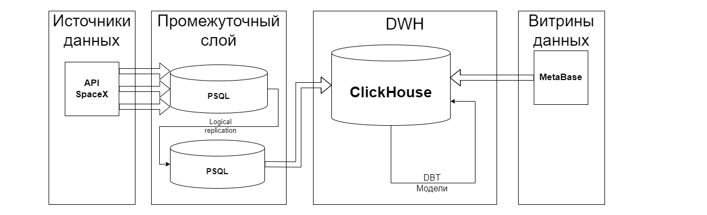
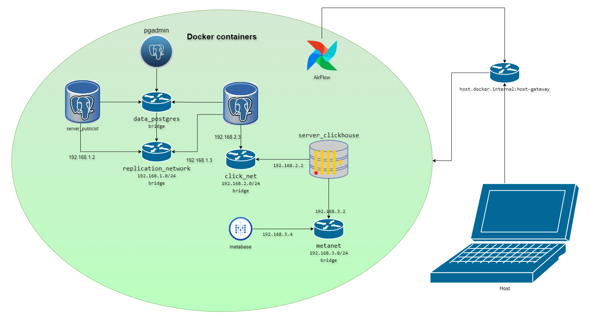

# Обработка данных SpaceX API 

## Задание проекта

Создание витрин данных на основе открытых данных компании [SpaceX](https://github.com/r-spacex/SpaceX-API/tree/master/docs#rspacex-api-docs).

Задачами проекта является настройка ETL-процесса по загрузке данных из API в базу данных, настройка сетей и логической репликации данных, автоматизация создания аналитических запросов поверх сырых данных и визуальное представление результатов на дашборде. В проекте настроен линтер для автоматического статического анализа кода через GitHub Actions. 

Используемые инструменты:

* [Docker v4.22.1](https://www.docker.com/)
* [Postgres v13](https://www.postgresql.org/)
* [ClickHouse v23.8](https://clickhouse.com/)
* [Python v3.8](https://www.python.org/)
* [AirFlow v2.8.2](https://airflow.apache.org/)
* [DBT v1.8.0](https://www.getdbt.com/)
* [MetaBase v0.49.8](https://www.metabase.com/)
* [super-linter v5.7.2](https://github.com/super-linter/super-linter)

## Схема процесса



В проекте происходят следующие процессы:

1. С помощью ETL-процесса посредством Airflow выгружаются данные из источника API SpaceX в БД PostgreSQL.
2. Внутренними средствами PostgreSQL создается "логическая репликация".
3. С помощью движка "PostgreSQL", входящего в состав ClickHouse, создаются таблицы.
4. Возможностями DBT создаются агрегационные представления данных.
5. С помощью MetaBase происходит обращение к представлениям в ClickHouse.

## Используемые библиотеки Python

* dbt-core
* dbt-clickhouse
* python-decouple
* requests
* sqlalchemy
* datetime
* logging
* json

## Настройка сети

В данном проекте хотелось уделить особое внимание настройкам и разграничениям сетей, тем самым приблизить данный проект к реальным условиям работы в компаниях, когда у рядового аналитика есть доступ не к первоначальной таблице, а только к конечному продукту. Как можно увидеть, в Docker Compose выделено 4 основных сетевых сегмента (маршрутизатора):

* data_postgres - сеть управления БД PostgreSQL (предполагается, что в данной сети будет работать только администратор и разработчик баз данных)
* replication_network (192.168.1.0/24) - предназначена исключительно для трансляции трафика логической репликацией
* click_net (192.168.2.0/24) - сеть подключения ClickHouse к PostgreSQL. Именно по данной сети CH будет выкачивать данные из PostgreSQL
* metanet (192.168.3.0/24) - сеть, по которой BI-система обращается к хранилищу данных (предполагается, что в данной сети работают аналитики)

Структурно сеть выглядит следующим образом:



## Запуск

Для запуска необходимо сделать следующие действия:

1. Выгрузить проект с помощью команды
    ```
    git clone git@github.com:ShustGF/spacex-api-analize.git
    ```
3. В каталоге проекта переименовать файл .env_template в .env, в котором необходимо указать следующие атрибуты (не меняйте имена переменных, так как на них есть ссылки в проекте):
    ```
    AIRFLOW_UID=50000
    POSTGRES_PUBLICIST_USER=postgres
    POSTGRES_PUBLICIST_PASSWORD=gfh0km
    POSTGRES_PUBLICIST_DB=postgres_publicist
    
    POSTGRES_SUBSCRIPTION_USER=postgres
    POSTGRES_SUBSCRIPTION_PASSWORD=gfh0km
    POSTGRES_SUBSCRIPTION_DB=postgres_subscriber
    
    CLICKHOUSE_USER=username
    CLICKHOUSE_PASSWORD=gfh0km
    CLICKHOUSE_DB=my_database
    ```
    (выше указан пример заполения, вы можете вставить свои данные)

3. Для правильной работы DBT необходимо создать в корне проекта каталог .dbt из каталога .dbt_template, внутри которого необходимо создать файл profiles.yml со следующим содержимым:
    ```
    ch_marts:
      target: dev
      outputs:
        dev:
          type: clickhouse
          schema: "{{ env_var('CLICKHOUSE_DB') }}"
          host: host.docker.internal
          port: 8123
          user: "{{ env_var('CLICKHOUSE_USER') }}"
          password: "{{ env_var('CLICKHOUSE_PASSWORD') }}"
          secure: False
    ```

4. Запустить Docker и командную оболочку (так как я работаю на ОС Windows, командная оболочка у меня WSL)
5. Перейти в корень проекта, где находится файл docker-compose.yaml
6. Выполнить следующую команду:
    ```
        docker compose up -d
    ```
7. После скачивания всех образов и поднятия всех контейнеров открыть браузер и прописать в поисковой строке:
    ```
        localhost:8080
    ```
8. Зайти в airflow (по умолчанию логин и пароль - airflow)

9. Запустить DAG
10. Перейти на новую вкладку и прописать:
    ```
        localhost:3000
    ```
11. Зарегистрироваться и создать свой дашборд на основе данных из таблиц и представлений. В моем случае дашборд выглядит следующим образом:

    
