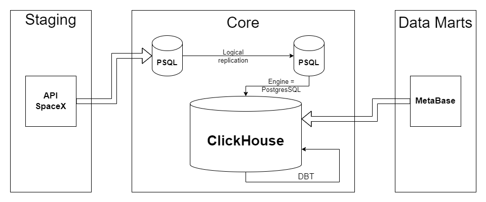

# Обработка данных SpaceX API 

## Задание проекта

Создание витрин данных на основе открытых данных компании SpaceX (https://github.com/r-spacex/SpaceX-API/tree/master/docs#rspacex-api-docs)

Результатом проекта является Dashbord в BI-системе Metabase.

Задачей данного проекта является знакомство с новыми библиотеками и новым програмным обеспечение. Важным аспектом данной работы является, умение работать с "классами", т.е. описание структуры данных таблицы должно быть сделано через них.

Используемые инструменты:

* Python v3.8
* AirFlow v2.8.2
* Postgres v13
* ClickHouse v23.8
* DBT v1.8.0
* MetaBase v0.49.8
* Docker v4.22.1

## Схема процесса



В проекте происходят следующие процессы:

1. С помощью ELT процесса, посредством Airflow, выгружается данные из источника API SpaceX  в БД PostgreSQL;
2. Внутреними средставми PostgreSQL, создаётся "логическая репликация";
3. С помощью движка "PostgreSQL", входящего в состав ClickHouse, создаём таблицы;
4. Возможностями DBT создаем агригационные представления данных;
5. С помощью MetaBase, обращается к представлениям в ClickHouse.

## Используемые библиотеки Python

* dbt-core
* dbt-clickhouse
* python-decouple
* requests
* sqlalchemy
* datetime
* logging
* json

## Настройка сети

В данном проекте хотелось уделить особое внимание настройкам и разграничениям сетей, тем самым приблизить данный проект к реальным условиям работы в компаниях, когда у рядового аналитика нет доступа к первоначальной таблице, а только к конечному продукту. Как можно увидеть в Docker Compose выделено 4 основных сетевых сегмента(маршрутизатора):

* data_postgres - сеть управления БД PostgreSQL (предолагается, что в данной сети будет работать только администратор и разработчик баз данных)
* replication_network(192.168.1.0/24) - предназначена исключительно для трансляции трафика логической репликацией
* click_net(192.168.2.0/24) - сеть подключения ClickHouse к PostgreSQL. Именно по данной сети CH будет выкачивать данные из PSQL
* metanet(192.168.3.0/24) - сеть по которой BI-система обращается к хранилища данных(предполагается, что в данной сети работаю аналитики)

Структурно сеть выглядит следующи образом:


## Запуск

Для запуска необходимо сделать следующие действия:

1. выгрузить проек с помощью команды 
    ```
    git clone git@github.com:ShustGF/spacex-api-analize.git```
2. в каталог проекта переименовать файл .env_template в .env, в котором необходимо указать следующие атрибуты(не меняйте имена переменных, так как на них ссылаются средства проекта):
```
AIRFLOW_UID= 50000
POSTGRES_PUBLICIST_USER=postgres
POSTGRES_PUBLICIST_PASSWORD=gfh0km
POSTGRES_PUBLICIST_DB=postgres_publicist

POSTGRES_SUBSCRIPTION_USER=postgres
POSTGRES_SUBSCRIPTION_PASSWORD=gfh0km
POSTGRES_SUBSCRIPTION_DB=postgres_subscriber

CLICKHOUSE_USER=username
CLICKHOUSE_PASSWORD=gfh0km
CLICKHOUSE_DB=my_database
```
(выше указан пример заполения, вы можете вставить свои данные)

3.Для правильной работы DBT необходимо создать в корне проекта каталог .dbt из каталог .dbt_template, внутри которого необходимо создан файл profiles.yml, со следующим содержимым:
```
ch_marts:
  target: dev
  outputs:
    dev:
      type: clickhouse
      schema: "{{ env_var('CLICKHOUSE_DB') }}"
      host: host.docker.internal
      port: 8123
      user: "{{ env_var('CLICKHOUSE_USER') }}"
      password: "{{ env_var('CLICKHOUSE_PASSWORD') }}"
      secure: False
```

4. Запускаем Docker и командную оболочну(так как я работаю на ОС Windows, командная оболочка у меня WSL)
5. Переходим в корень проекта, где находистся файл docker-compose.yaml
6. Выполняем следующую команду:
```
    docker compose up -d
```
7. После скачивания всех images и поднятия всех контейнеров, открываем браузер и в поисковой строке прописываем:
```
    localhost:8080
```
8. Заходим в airflow (по умолчанию логин и пароль - airflow)

9. Запускаем DAG
10. Переходим на новую вкладку и прописываем:
```
    localhost:3000
```
11. Регистрируемся и создаем свой дашборд на основе данных представленных в таблицах и представлениях. В моём случае, Dashbord выглядит следующим образом:

